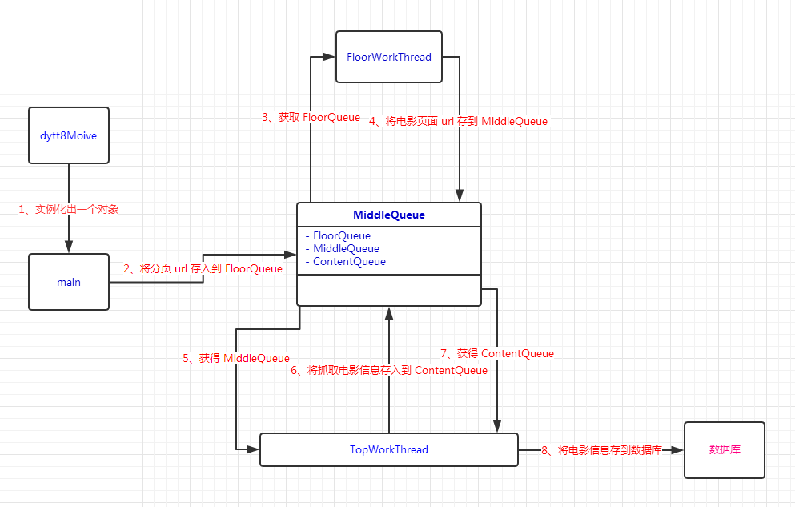
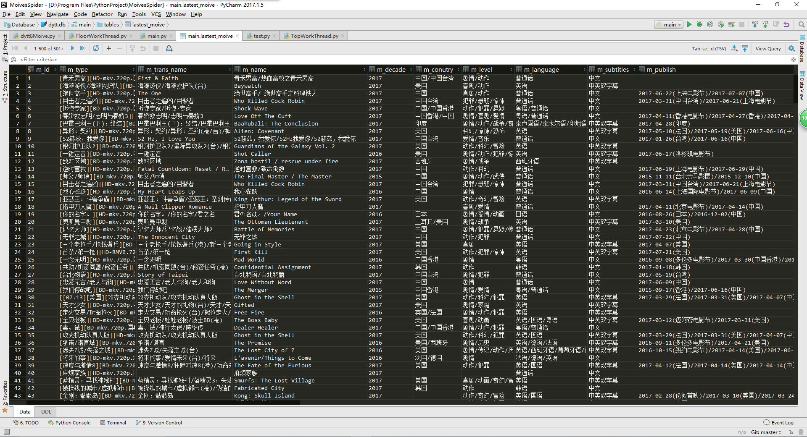

# 1 爬取入口
电影天堂有 5 个电影栏目，分别为**最新电影**、**日韩电影**、**欧美电影**、**国内电影**、**综合电影**。每个栏目又有一定数量的分页，每个分页有 25 条电影信息。那么程序的入口可以有 5 个 url 地址。这 5 个地址分别对应每个栏目的首页链接。

# 2 爬取思路
>知道爬取入口，后面的工作就容易多了。我通过测试发现这几个栏目除了页面的 url 地址不一样之外，其他例如提取信息的 xpath 路径是一样的。因此，我把 5 个栏目当做 1 个类，再该类进行遍历爬取。

我这里“最新电影”为例说明爬取思路。
1）请求栏目的首页来获取到分页的总数，以及推测出每个分页的 url 地址；
2）将获取到的分页 url 存放到名为 floorQueue 队列中；
3）从 floorQueue 中依次取出分页 url，然后利用多线程发起请求；
4）将获取到的电影页面 url 存入到名为 middleQueue 的队列；
5）从 middleQueue 中依次取出电影页面 url，再利用多线程发起请求；
6）将请求结果使用 Xpath 解析并提取所需的电影信息；
7）将爬取到的电影信息存到名为 contentQueue 队列中；
8）从 contentQueue 队列中依次取出电影信息，然后存到数据库中。

# 3 设计爬虫架构
根据爬取思路，我设计出爬虫架构。如下图所示：

# 4 代码分析

- main 类
主要工作两个：第一，实例化出一个`dytt8Moive`对象，然后开始爬取信息。第二，等爬取结束，将数据插入到数据库中。

- TaskQueue 类
维护 floorQueue、middleQueue、contentQueue 三个队列的管理类。之所以选择队列的数据结构，是因为爬虫程序需要用到多线程，队列能够保证线程安全。

- dytt8Moive 类
dytt8Moive 类是本程序的主心骨。程序最初的爬取目标是 5 个电影栏目，但是目前只现实了爬取最新栏目。如果你想爬取全部栏目电影，只需对 dytt8Moive 稍微改造下即可。

# 5 爬取结果
我这里展示自己爬取最新栏目中 4000 多条数据中前面部分数据。
